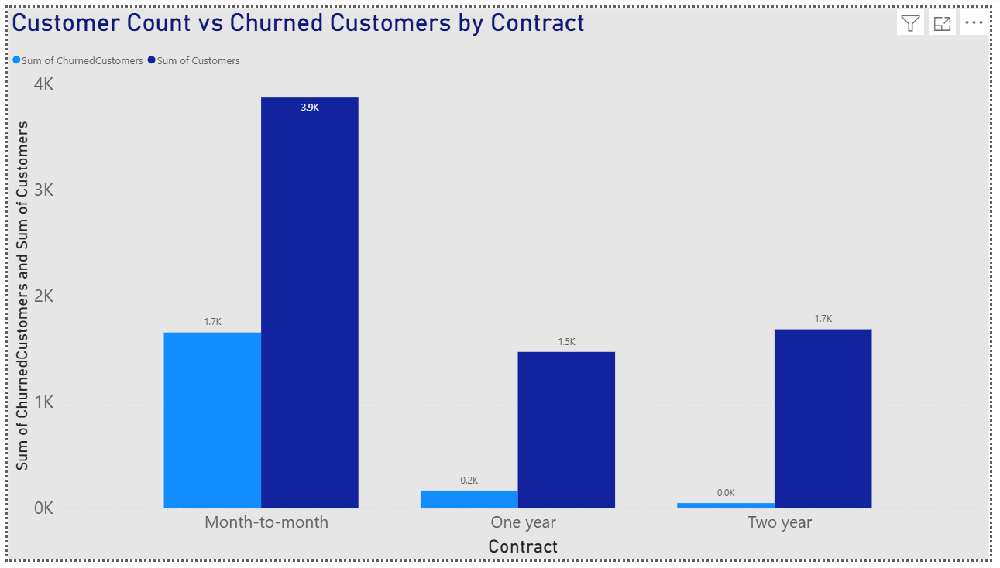
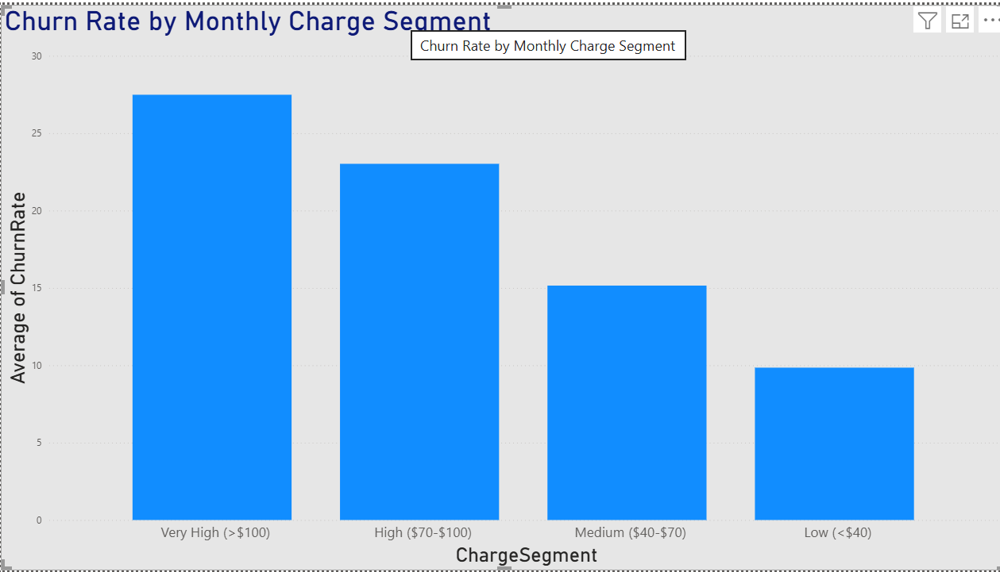
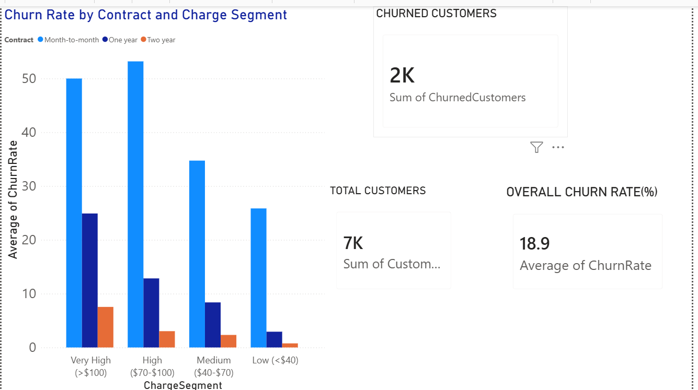

# Task 1 – Customer Churn Analysis

## Project
Customer Churn Analysis using Power BI

## Description
An interactive Power BI dashboard created to analyze customer churn patterns, contract types, monthly charge segments, and high-risk customer groups.

## Tools Used
- Power BI
- DAX
- Data Analysis
- Data Visualization

## Key Insights
- Overall Churn Rate: 18.9%
- Total Customers: 7K
- Churned Customers: 2K
- Month-to-month contracts show higher churn.
- Higher monthly charge segments have higher churn rates.

## Project Screenshots

### Churn Rate by Contract

### Churn Rate by Charge Segment

### Contract and Charge Analysis

